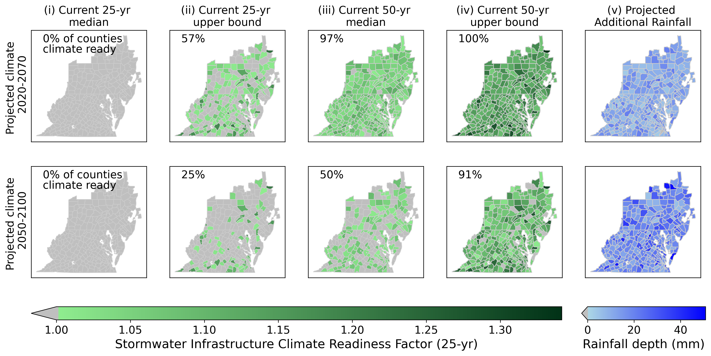
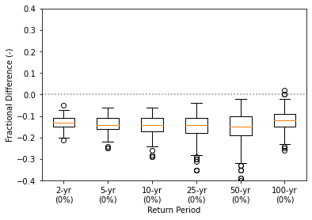
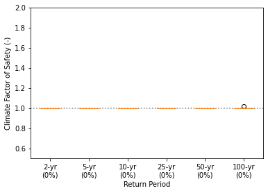

# Design strategies for climate resilient urban stormwater infrastructure
In an upcoming publication, we offer recommendations for the use of current precipitation estimates to responsibly design and plan for climate resilient stormwater infrastructure until updated precipitation estimates accounting for climate change are available.
This repository contains a collection of Python scripts to analyze [IDF curves](https://en.wikipedia.org/wiki/Intensity-duration-frequency_curve) that were developed using delta-change method for the Chesapeake Bay Watershed and Virginia, and assess four design strategies by comparing precipitation depths from each strategy to projected precipitation depths for 321 counties in the study area.


## Dependencies
```
geopandas >= 0.10.1
numpy >= 1.21.4
matplotlib >= 3.4.3
pandas >= 1.5.1
requests >= 2.26.0
scipy >= 1.7.1

```


## Required input

- Data downloaded from the Projected Intensity-Duration-Frequency (IDF) Curve Data Tool for the Chesapeake Bay Watershed and Virginia [webpage](https://midatlantic-idf.rcc-acis.org/). Format should be `csv`. For each script, you are required to specify the path where this csv file is located and confirm the locations where output will be saved.
- Data needed for mapping final results (shapefiles for the study area, etc.) are included with this repository.

## Notes for Python scripts
Each Python script can be run independently, or all of the scripts can be run from `IDFcurves_main.py`.

## Output
For a complete description of each file generated by running this code, please see `fileTBD.csv`.

General files: as generated in the main folder
- Table with metadata about each county (`CBP_countycentroids.csv`).
- Map representing the study area (`CBWmap.png`)

Maps: as generated in the maps folder.
- Choropleth maps showing counties in gradated colors if climate factor of safety is greater than 1.0.

Tables and other figures: as generated in each strategy's folder.
- Tables representing precipitation depth associated with each strategy. Output file format is csv. The first column being the counties in the study area and several other columns for different return periods (2-yr, 5-yr, 10-yr, 25-yr, 50-yr, 100-yr). Each strategy has:
	- three files representing present-day precipitation depths for the median, upper confidence interval (max) and lower confidence interval (short): (`output_atlas_CBW.csv`, `output_atlas_min.csv`, `output_atlas_max.csv`).
	- four files representing potential future day precipitation depths for RCP 4.5 and RCP 8.5, for 2020-2070 (short) and 2050-2100 (long): (`output_45short.csv`, `output_45long.csv`, `output_85short.csv`, `output_85long.csv`).
- Tables representing climate factor of safety associated with each strategy. Output file format is csv. The first column being the counties in the study area and several other columns for different return periods (2-yr, 5-yr, 10-yr, 25-yr, 50-yr, 100-yr). Each strategy has:
	- four files representing potential future day precipitation depths for RCP 4.5 and RCP 8.5, for 2020-2070 (short) and 2050-2100 (long): ( `output_frac_45short.csv`, `output_frac_45long.csv`, `output_frac_85short.csv`, `output_frac_85long.csv`).
- Boxplots representing fractional difference between strategy and projected precipitation  for all 321 counties, for each return period. Each strategy has:
	- four plots representing potential future day precipitation depths for RCP 4.5 and RCP 8.5, for 2020-2070 (short) and 2050-2100 (long).
- Boxplots representing stormwater climate factors of safety for all 321 counties, for each return period. Each strategy has:
	- four plots representing potential future day precipitation depths for RCP 4.5 and RCP 8.5, for 2020-2070 (short) and 2050-2100 (long).


## Example

After cloning this repository, the outputs described above will be available in the folders representing each strategy, or in the general map folder

Example of figures generated as output (for Strategy 1: designing to Atlas14 median precipitation depth):








### Acknowledgements

We are grateful to the Mid-Atlantic Climate Adaptation Partnership (CAP) team and other stakeholders for making the data publicly available.
