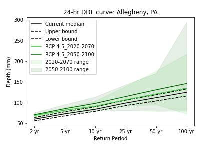
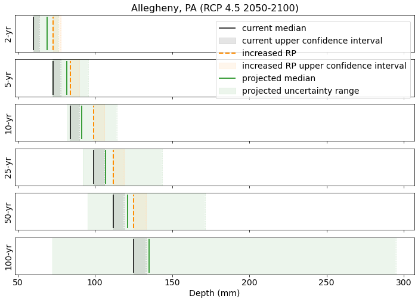

# Design strategies for climate resilient urban stormwater infrastructure
In an upcoming publication, we offer recommendations for the use of current precipitation estimates to responsibly design and plan for climate resilient stormwater infrastructure until updated precipitation estimates accounting for climate change are available.
This repository contains a collection of Python scripts to analyze [IDF curves](https://en.wikipedia.org/wiki/Intensity-duration-frequency_curve) that were developed using delta-change method for the Chesapeake Bay Watershed and Virginia, and assess four design strategies by comparing precipitation depths from each strategy to projected precipitation depths for 321 counties in the study area.


## Dependencies
```
geopandas >= 0.10.1
numpy >= 1.21.4
matplotlib >= 3.4.3
pandas >= 1.5.1
requests >= 2.26.0
scipy >= 1.7.1

```


## Required input

- Data downloaded from the Projected Intensity-Duration-Frequency (IDF) Curve Data Tool for the Chesapeake Bay Watershed and Virginia [webpage](https://midatlantic-idf.rcc-acis.org/). Format should be `csv`. For each script, you are required to specify the path where this csv file is located and confirm the locations where output will be saved.
- Data needed for mapping final results (shapefiles for the study area, etc.) are included with this repository.

### Notes for running scripts
Each Python script can be run independently, or all of the scripts can be run from `IDFcurves_main.py`.
You will need to change the user defined variables named `path` and `path_main` to refer to your local directories.

## Output
General files: in the main folder
- Folder with NOAA Atlas14 webscraped data (`atlas14`)
- Table with metadata about each county (`CBP_countycentroids.csv`).
- Map representing the study area (`CBWmap.png`)

Maps: as generated in the `maps` folder.
- Map of the US with an inset of the study area (`CONUSmap+CBW+inset.png`)
- Chloropleth maps showing counties in gradated colors if climate factor of safety is greater than 1.0.

Tables and other figures representing all counties: as generated in each strategy's folder.
- Tables representing precipitation depth associated with each strategy. Output file format is csv. The first column being the counties in the study area and several other columns for different return periods (2-yr, 5-yr, 10-yr, 25-yr, 50-yr, 100-yr). Each strategy has:
	- three files representing present-day precipitation depths for the median, upper confidence interval (max) and lower confidence interval (min): (`output_atlas_CBW.csv`, `output_atlas_min.csv`, `output_atlas_max.csv`).
	- four files representing potential future precipitation depths for RCP 4.5 and RCP 8.5, for 2020-2070 (short) and 2050-2100 (long): (`output_45short.csv`, `output_45long.csv`, `output_85short.csv`, `output_85long.csv`).
- Tables representing climate factor of safety (also known as climate resadiness factor) associated with each strategy. Output file format is csv. The first column being the counties in the study area and several other columns for different return periods (2-yr, 5-yr, 10-yr, 25-yr, 50-yr, 100-yr). Each strategy has:
	- four files representing potential future precipitation depths for RCP 4.5 and RCP 8.5, for 2020-2070 (short) and 2050-2100 (long): ( `output_frac_45short.csv`, `output_frac_45long.csv`, `output_frac_85short.csv`, `output_frac_85long.csv`).
- Boxplots representing fractional difference between strategy and projected precipitation  for all 321 counties, for each return period. Each strategy has:
	- four plots representing potential future precipitation depths for RCP 4.5 and RCP 8.5, for 2020-2070 (short) and 2050-2100 (long).
- Boxplots representing stormwater climate factors of safety (FS) for all 321 counties, for each return period. Each strategy has:
	- four plots representing potential future precipitation depths for RCP 4.5 and RCP 8.5, for 2020-2070 (short) and 2050-2100 (long).

Figures representing each county (example for Allegheny County): generated in the `individualcounties` folder:
- IDF curves for RCP 4.5 2020-2070 and 2050-2100 with uncertainty bands for projected precipitation
- four figures comparing precipitation depth for each return period for Atlas 14 to each of the four potential future precipitation depths (for RCP 4.5 and RCP 8.5, for 2020-2070 and 2050-2100).

Output representing uncertainty associated with potential future precipitation depths: for strategy 1 (`atlasmedian_percentiles`) and strategy 2 (`atlasCI_percentiles`):
- maps: four figures comparing precipitation depth for each return period for Atlas 14 to percentiles for each of the four potential future precipitation depths (for RCP 4.5 and RCP 8.5, for 2020-2070 and 2050-2100).
- csv files: representing precipitation depth associated with each strategy. Output file format is csv. The first column being the counties in the study area and several other columns for different return periods (2-yr, 5-yr, 10-yr, 25-yr, 50-yr, 100-yr). Each strategy has files reprsenting each of the potential future precipitation scenarios (for RCP 4.5 and RCP 8.5, for 2020-2070 and 2050-2100) for each of the percentiles (min, 10th, 25th, 50th, 70th, 90th, max).

## Example

After cloning this repository, the outputs described above will be available in the folders representing each strategy, or in the `maps` folder.

### Examples of figures generated as output (for Strategy 1: designing to Atlas14 median precipitation depth):


### Examples of figures generated as ouput for individual counties:





### Examples of figures generated as output for uncertainty analysis:


## Acknowledgements

We are grateful to the Mid-Atlantic Climate Adaptation Partnership (CAP) team and other stakeholders for making the data publicly available.
